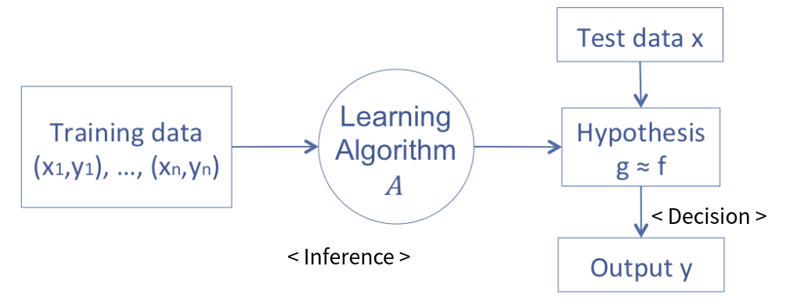

<script type="text/javascript" src="http://cdn.mathjax.org/mathjax/latest/MathJax.js?config=TeX-AMS-MML_HTMLorMML"></script>

<!-- page_number: true -->

Bayes Decision Theory
===============

김경환

---

# Machine Leaning Problem
- 머신러닝 문제는 해결 순서는 다음과 같다.
	- 주어진 data에 대해 가정을 함.
	- 그 중 최상의 가정을 찾는다.
	- 최상의 가정을 이용해 decision을 내린다.



---
# Bayes Decision Theory ?

### Decision Theory

- 어떤 문제를 풀기 위해서는 decision making을 해야한다.
	ex) classification 문제 -> 이 데이터가 어떤 class인가를 decision

- decision을 어떻게 결정할 것인가? 에 대해 다루는 이론

### Bayes Decision Theory

- Bayes Rule을 이용해 decision을 결정한다.

---

# Bayes Rule

$$P(C|X) = {P(X|C)P(C) \over P(X)} $$

- P(C) : __prior probability__, 사전 확률
- P(X|C) : __likelihood__, C에 속한 사건이 x를 가질 확률
- P(X) : __evidence__, 데이터 x에 대한 확률
- P(C|X) : __posterior probability__, 사후 확률

###### Bayes rule 참고 : http://se2n.com/study/io/%EC%9D%B8%EA%B3%B5%EC%A7%80%EB%8A%A5/79

---

# 은행 고객의 신용도 문제

- 고객이 들어 왔을 때 신용도를 판단해보자.
- class는 2 개다. (class 1 : 신용 높음,  class 0 : 신용 낮음)

---

# Only prior prob.

- 단순히 class에 대한 사전 정보만 가지고 결정을 내린다.
```
- 현재 보유 고객 중 신용 높음 : 60 %, 낮음 : 40 % 이면
- P(C=1) > P(C=0) 이므로
- 다음 고객은 C = 1라고 결정.
```
- 이 경우 제대로 된 결정이라고 보기 어렵다.
```
더 쉬운 예제
- 복권가게 A, B가 있다.
- A가게는 당첨자가 100명 중 5명 나왔고,
- B가게는 당첨자가 100명 중 2명 나왔다.
- 사람들은 A 가게가 확률이 더 높으므로 A를 고를 것이다.
```
---

# Using likelihood

- 주어진 class에 대해 관측된 data를 추가로 알고 있다면 `P(X|C)`
- Bayes Rule에 의해 data에 대한 class의 확률 `P(C|X)` 을 알 수 있다.
- `P(C|X)`를 이용하면 좀 더 합리적인 결정을 할 수 있다.
```
- 고객의 연봉이 2000 이상이면 신용 높음일 확률이 90 % 라고 하면
- 고객의 연봉에 따라 P(X|C=0,1)가 정해지고
- Bayes Rule에 의해 P(C=0,1|X)가 정해지며
- P(C=0|X)과 P(C=1|X)를 비교해서
- 고객의 class를 decision 할 수 있다.
```
$$ Decision \begin{cases} C=1 & \text{if } P(C=1|x) > P(C=0|x) \\
C=0 & \text{otherwise} \end{cases} $$

---

# Loss
- 결정한 decision이 잘 맞았는지에 대한 정도를 loss(error)로 하고 loss를 최소화시키는 방향으로 학습해야한다.
- Loss를 정의하는 방법은 다양하지만 간단한 방법으로 zero-one loss가 있다.
- 결정한 decision(예측한 값)이 실제 값과 맞으면 1, 틀리면 0
$$ L(C_i, C_k )  = \begin{cases} 1 &\text{if } i=k \\ 0 &\text{otherwise} \end{cases} $$

---

# Risk
- 실제 현상에서는 decision에 따라 특히 큰 피해를 입거나, 틀려도 별로 손해가 없는 경우가 있다.
- 이러한 문제를 Risk로 표현한다.
	> 질병 진단 문제 - 질병이 있는데 없다고 했을 경우가 더 Risk가 크다.
- Risk는 Loss의 기대값으로 표현 가능하다.
- loss를 최소화시키는 문제에서 risk를 최소화시키는 문제로 바뀐다.
$$ R(C_i|x) = \sum_{k}L(C_i, C_k)P(C_k|x) = \sum_{i\ne k}P(C_k|x) = 1-P(C_i|x) $$
$$ \hat C_i = argmin_{i}R(C_i|x)  $$

---

# Reject
- 어떤 상황에서는 decision을 내리지 않고 가만히 있는 경우가 Risk가 더 적을 때도 있다.
- 가만히 있는 결정을 $C_{K+1}$ 이라 하면
$$ L(C_i, C_k )  = \begin{cases} 1 &\text{if } i=k \\ 0<L<1 &\text{if } i=k+1 \\ 0 &\text{otherwise} \end{cases} $$

---

# Optimal Decision rule
- 따라서 Risk에 따라 최선의 decision을 고르는 방법은 다음과 같다.
- 이러한 방법을 `Bayes estimator(Bayes classifier)`라고 한다.
$$ \hat C_k = argmin_{k}R(C_k|x) = argmin_k(1-P(C_k|x))$$
$$ = argmax_kP(C_k|x) $$
$$ \begin{cases} C_k &\text{if } maxP(C_k|x) \ \& \  P(C_k|x) > 1-L
\\ Reject &\text{otherwise} \end{cases} $$

---

# Density Estimation
- 위에서 최선의 Decision은 $P(C_k|x)$가 최대인 decision임을 알았다.
- 그렇다면 $P(C_k|x)$는 어떻게 구할수 있을까 -> Bayes Rule
$$P(C|X) = {P(X|C)P(C) \over P(X)} $$
$$ P(C|X) \propto P(X|C)P(C) $$
- 즉 `P(X,C)`의 분포를 알면 구할 수 있다.

---

# Density Estimation
- Density Estimation : 분포를 data를 이용해 추정한다.
- `P(X,C)`의 분포는 data를 통해 추정할 수 있다.
	1. Parametric
		- 우리가 잘 알고 있는 model의 형태를 따른다고 가정하여 추정한다.
		- model의 parameter를 조정해서 쉽게 분포를 조정할 수 있다.
		- ex) Gausian(->Naive Bayes), GMM(Gaussian Mixture Model)
	2. Non-Parametric
		- 단순히 data에 의존해서 분포를 추정한다.
		- 분포를 조정하기 어렵다.

---

# Reference
- 고려대 석흥일 교수님 강의 자료
- http://sanghyukchun.github.io/61/
- wiki
